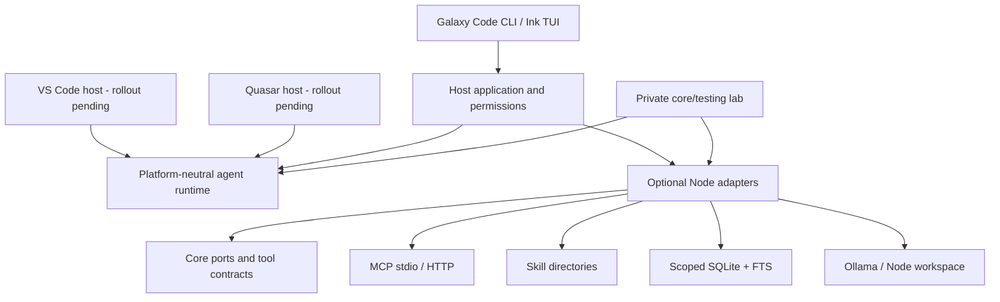

# Shared Galaxy Agent platform

Implementation baseline: 2026-09-23. Existing repo/npm identities are preserved.

## Dependency direction



Root imports must not load Node adapters, MCP SDK, SQLite or React. Optional adapters are separate subpath exports within the existing npm package to avoid creating new repository/trusted-publisher bindings before module boundaries stabilize. This does not make provider I/O part of the runtime's responsibility: the host chooses and constructs each adapter.

## Entry points

| Import suffix after `@galaxy-stack/ai-coder-core/` | API |
|---|---|
| `agent` | AgentMemoryPort, AgentSkillsPort, AgentToolExecutor, CompositeToolExecutor, agentFunction, memoryTools, skillTools |
| `adapters/node/tools/tool-executor` | NodeToolExecutor, existing workspace/command/project tools; optional approvalTimeoutMs |
| `adapters/node/tools/workspace-review` | NodeWorkspaceReviewExecutor for bounded text-change review in non-Git scratch workspaces |
| `adapters/node/provider/ollama-coding-model` | OllamaCodingModel, provider-specific thinking option |
| `adapters/node/mcp/mcp-client` | McpAgentClient.connect, tools, list/read resources, list/get prompts, close |
| `adapters/node/skills/directory-skills` | DirectorySkills, qualified catalog IDs, lazy load/readResource |
| `adapters/node/memory/sqlite-memory` | SqliteAgentMemory(path, hostScope), search/remember/history/forget/close |
| `adapters/node/host/file-run-store` | Trusted checkpoint/final-report store |

## Runtime integration

Compose `NodeToolExecutor` and `AgentToolExecutor` with `CompositeToolExecutor`. Duplicate model tool names fail instead of shadowing one another. Agent tool authorization is supplied by the host and checked before dispatch. Adapter results remain external/workspace data and have no host-attested completion effects. MCP uses SDK JSON Schema validation; local tools use the core schema validator.

Core `contextData` accepts up to 32 items, each with a source up to 1024 characters and content up to 32000 characters. It is wrapped as untrusted data in the user-task envelope and bound to checkpoint integrity. Do not pass historical notes through `trustedWorkspaceInstructions`.

`agentProfile: "assistant"` and `"research"` default `completion.requireInspection` to false. A host can explicitly require inspection for a repository task. Coding remains the default and existing completion guarantees remain in place. Research-specific citation criteria can still be explicitly configured on the run request.

## Approval and scratch workspace review

Approval callbacks receive a request-scoped signal. The policy aborts that signal when the request completes, times out or is canceled so the host can dismiss its prompt. A timeout cannot accept a late approval and does not abort the parent run. NodeToolExecutor forwards an optional `approvalTimeoutMs`; defaults remain 30 seconds, while the interactive CLI selects five minutes.

`NodeWorkspaceReviewExecutor.create(workspace, context)` captures a stable baseline before model execution. Compose it when Git is unavailable and disable the Git catalog. It exposes `review_changes`, compares actual before/after content and hashes, and alone attests its `inspect`/`diff_review` effects. It is not an untrusted MCP/AgentTool wrapper. No validation requirement is waived. Large, binary/special or concurrently changed files fail closed; current limits are an 8 MiB baseline text cache, 128 KiB reads and 24 KiB serialized changes. Task-scoped baselines are not persisted for crash resume.

## Memory v1 semantics

A memory port instance is bound to a host scope. The model cannot choose another scope through tool arguments. CLI scopes hash canonical workspace paths; different worktrees are isolated.

Rows retain key, ID, revision, content, source, content hash, active/superseded status, candidate/confirmed trust and update time. `(scope, key, revision)` is unique; writes use an immediate transaction and optional expectedRevision. Identical content/source/trust is idempotent. A candidate cannot replace a confirmed record. The active revision supersedes older revisions under the same key; history remains until explicit forget.

FTS uses tokenized, quoted input rather than interpolated SQL. Automatic recall excludes candidates/superseded rows and is bounded to four records by the CLI. Search results are context, not current evidence. Forget deletes all key revisions plus FTS rows and checkpoints the WAL. Backups owned by the user are not erased.

Schema v1 is initialized idempotently. SQLite is an optional Node adapter, not a required backend for browser/extension hosts. Current storage is separate from Quasar Memory Tree; no existing desktop memory DB was migrated or modified. Kind/conditions, source commit anchoring, graph/embedding ranking, TTL, autonomous consolidation and a schema upgrade from the desktop engine are future phases with their own tests.

## MCP and skills

MCP supports stdio and Streamable HTTP, bounded catalog/schema/output sizes, timeout/cancellation, namespaced tools, resources/prompts APIs and transport cleanup. All MCP tools require host permission regardless of annotations. OAuth and automatic reconnect/catalog refresh during an active run remain future work. Explicit calls to resources/prompts return data; hosts must not elevate their text to system instructions.

Skills support YAML frontmatter, user/workspace qualified IDs, a 256-entry catalog, 64 KiB regular-file reads, hash validation between discovery/loading and canonical path checks. Skill instructions do not grant shell/network permissions. Marketplace installation and skill dependency resolution are not implemented.

## Lab and validation

```sh
npm ci
npm run verify
cd testing
npm ci
npm run typecheck:local
npm run test:local
npm run dev -- run --fixture fixtures/write-and-validate.json --json
npm run dev -- health --live --scenario live/scenarios/01-write-and-validate.json --json
```

Fixtures, recordings, contract doubles, runners and tests live under `testing/`. Production adapters live under `src/adapters/node`. Lab wrapper imports reference those exact exports, so fixes are tested against the implementation shipped to hosts.

## Rollout and release

1. Verify core, private lab and CLI independently; retain live versus mock evidence separately.
2. Release a compatible core version through its existing publisher.
3. Replace the CLI's local `file:` dependency with the released version before standalone npm publishing.
4. Adapt VS Code/Quasar to the new contracts incrementally and run host conformance tests.
5. Migrate Quasar memory only with a backup, dry-run scope mapping and rollback validation.

No new repo/package is required for this stage. Local execution and tests do not publish npm packages or modify GitHub.
